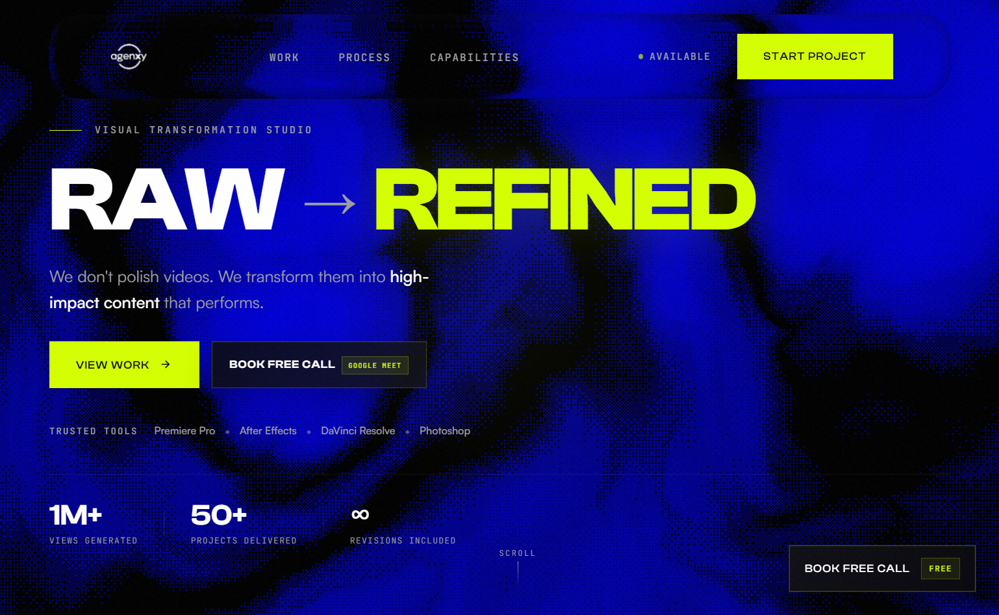

# AGENXY.MEDIA

<p align="center">
  
</p>

<p align="center">
  Premium digital media agency website for short-form editing, creator branding, and social-first content.
</p>

<p align="center">
  <a href="https://agenxymedia.vercel.app"><strong>Live Site</strong></a>
</p>

---

## What this is

AGENXY.MEDIA is a modern agency website built for a creator-first digital media studio.

It is designed to sell the brand properly: not like a generic template, not like a safe corporate landing page, but like a studio that actually understands content, attention, and how people buy creative services online.
The site positions AGENXY as a sharp, technical, social-native media brand focused on turning raw ideas into polished content that performs.

## What the agency does

AGENXY.MEDIA is built around services like:

- Short-form video editing
- Reels editing
- YouTube editing
- Creator branding
- Social-first content production
- Visual storytelling for creators, startups, and personal brands

## What the site includes

- Strong hero section with clear positioning
- Interactive visual treatment and motion
- Service and capability breakdown
- Portfolio and work showcase
- Testimonials and trust-building sections
- High-intent CTA flow
- Booking integration for discovery calls
- Responsive frontend built for modern browsers

## Tech stack

- React
- Vite
- Tailwind CSS
- Three.js
- React Three Fiber
- Vercel

## Project structure

```bash
AGENXY-MEDIA/
├── public/
├── src/
│   ├── assets/
│   ├── components/
│   ├── lib/
│   ├── App.jsx
│   ├── App.css
│   ├── index.css
│   └── main.jsx
├── brand_identity.md
├── package.json
├── vite.config.js
└── README.md
```

## Live website

[https://agenxymedia.vercel.app](https://agenxymedia.vercel.app)

## Why this repo exists

A lot of agency websites look interchangeable.

This one was built to feel more specific: more founder-led, more internet-aware, more aligned with creator culture, and way more intentional in how it presents the brand.

It is part portfolio, part positioning system, and part proof that the studio can actually execute.

## Credits

Designed and developed by [Aryan Sharma](https://github.com/aryanjohnsharma)

## License

MIT
